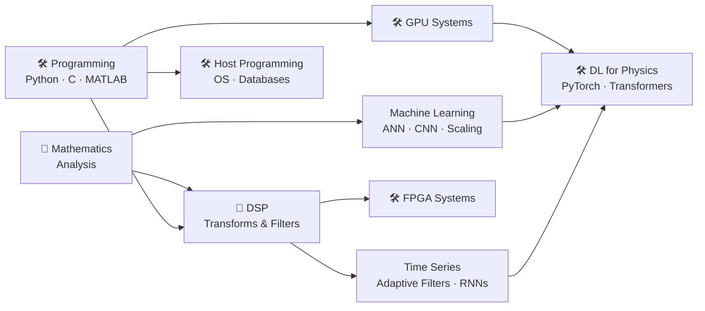

# SPS Curriculum

**Educational workshops in Signal Processing & Machine Learning Systems** — taught at the
University of Florida since 2024.

Every workshop is partitioned into **30–40 minute sessions** sized for a live meeting,
tagged as **Theory** 📐 (proofs, derivations, why it works) or **Application** 🛠️
(runnable code, real data, how to build it). Each topic README lists its session
breakdown, objectives, and cross-references.

## Curriculum Map

## Workshops

| Topic | Workshop | Focus | Status | Contributors |
|---|---|---|---|---|
| [**Mathematics**](./Intro_Math/README.md) | [Real Number Systems](./Intro_Math/Analysis/Real_Number_Systems.ipynb) | 📐 Theory | ✅ Available | [Raul](https://github.com/Jibby2k1) |
| | [Basic Topology](./Intro_Math/Analysis/Basic_Topology.ipynb) | 📐 Theory | ✅ Available | [Raul](https://github.com/Jibby2k1) |
| | [Numerical Sequences and Series](./Intro_Math/Analysis/Numerical_Sequences_and_Series.ipynb) | 📐 Theory | ✅ Available | [Raul](https://github.com/Jibby2k1) |
| | [Measure Theory](./Intro_Math/Analysis/Measure_Theory.ipynb) | 📐 Theory | 📝 Draft¹ | [Raul](https://github.com/Jibby2k1) |
| | [Random Variables](./Intro_Math/Analysis/Random_Variables.ipynb) | 📐 Theory | 📝 Draft¹ | [Raul](https://github.com/Jibby2k1) |
| | [Independence](./Intro_Math/Analysis/Independence.ipynb) | 📐 Theory | 📝 Draft¹ | [Raul](https://github.com/Jibby2k1) |
| [**Programming**](./Intro_Programming/README.md) | [Introduction to C](./Intro_Programming/Intro_C.ipynb) | 🛠️ Application | ✅ Available | [Raul](https://github.com/Jibby2k1) |
| | [Introduction to Python](./Intro_Programming/Intro_Python/Intro_Python.ipynb) | 🛠️ Application | ✅ Available | [Raul](https://github.com/Jibby2k1) |
| | [Introduction to MATLAB](./Intro_Programming/Intro_MATLAB/Intro_MATLAB.ipynb) | 🛠️ Application | 📝 Draft¹ | [Raul](https://github.com/Jibby2k1) |
| [**Host Programming**](./Intro_Host_Prog/README.md) | [Operating Systems](./Intro_Host_Prog/Intro_OS/Intro_OS.ipynb) | 📐+🛠️ | ✅ Available | [Raul](https://github.com/Jibby2k1) |
| | [Databases](./Intro_Host_Prog/Intro_Databases/Intro_Databases.ipynb) | 🛠️ Application | ✅ Available | [Raul](https://github.com/Jibby2k1) |
| [**DSP**](./Intro_DSP/README.md) | [Foundations of Signal Processing](./Intro_DSP/Foundations_of_Signal_Processing_1.ipynb) | 📐 Theory | ✅ Available | [Raul](https://github.com/Jibby2k1) |
| | [Filter Design](./Intro_DSP/Filter_Design.ipynb) | 🛠️ Application | ✅ Available | [Raul](https://github.com/Jibby2k1) |
| [**GPU Systems**](./Intro_GPU/README.md) | [GPU-Accelerated Computing (Numba & CuPy)](./Intro_GPU/Intro_GPU.ipynb) | 📐+🛠️ | ✅ Available | [Raul](https://github.com/Jibby2k1) |
| | [RAPIDS](./Intro_GPU/Intro_RAPIDS.ipynb) | 🛠️ Application | 📝 Draft¹ | [Raul](https://github.com/Jibby2k1) |
| [**FPGA Systems**](./Intro_FPGA/README.md) | [Introduction to FPGA](./Intro_FPGA/Intro_FPGA.ipynb) | 🛠️ Application | 📝 Draft¹ | [Raul](https://github.com/Jibby2k1) |
| [**Time Series**](./Intro_Time_Series/README.md) | [Adaptive Filtering (APA)](./Intro_Time_Series/Intro_AdFilt_APA.ipynb) | 📐+🛠️ | ✅ Available | [Raul](https://github.com/Jibby2k1) |
| | [Adaptive Filtering (Kalman)](./Intro_Time_Series/Intro_AdFilt_KF.ipynb) | 📐+🛠️ | ✅ Available | [Raul](https://github.com/Jibby2k1) |
| | [Recurrent Neural Networks](./Intro_Time_Series/Intro_RNN.ipynb) | 📐+🛠️ | ✅ Available | [Raul](https://github.com/Jibby2k1) |
| [**Machine Learning**](./Intro_Mach_Learn/README.md) | [Artificial Neural Networks](./Intro_Mach_Learn/Intro_ANN/Intro_ANN.ipynb) | 📐+🛠️ | ✅ Available | [Raul](https://github.com/Jibby2k1) |
| | [Convolutional Neural Networks](./Intro_Mach_Learn/Intro_CNN/Intro_CNN.ipynb) | 📐+🛠️ | ✅ Available | [Raul](https://github.com/Jibby2k1) |
| | [Scaling Neural Networks](./Intro_Mach_Learn/Scale_NN/Scale_NN.ipynb) | 📐+🛠️ | ✅ Available | [Raul](https://github.com/Jibby2k1) |
| [**DL for Physics**](./Intro_DL_4_Physics/README.md) | [Introduction to PyTorch](./Intro_DL_4_Physics/intro_pytorch/intro_pytorch.ipynb) | 🛠️ Application | ✅ Available | [Awwab](https://github.com/kaddu341) |
| | [Introduction to Transformers](./Intro_DL_4_Physics/intro_transformers/intro_transformers.ipynb) | 🛠️ Application | ✅ Available | [Awwab](https://github.com/kaddu341) |

¹ **📝 Draft** = complete but pending instructor verification (math proofs, or code needing MATLAB/FPGA/GPU hardware to run). Each draft carries a ⚠️ banner in the notebook; it is removed once an instructor signs off.

## Getting Started

1. **Pick a session**, not a whole notebook — each topic README maps its notebooks into
   30–40 minute sessions with objectives and prerequisites.
2. **Run the notebooks** in [Jupyter](https://jupyter.org/) or
   [Google Colab](https://colab.research.google.com/) (upload the `.ipynb`, or open via
   `File → Open notebook → GitHub` and paste this repo's URL).
3. **Theory or application?** 📐 sessions are lecture/whiteboard-friendly; 🛠️ sessions
   are live-coding-friendly. Most workshops interleave both and cross-reference each
   other.

## Contributing

📝 **Draft** workshops need an instructor verification pass — a great first contribution. To contribute:

1. Fork the repo and create a feature branch.
2. Pick a planned workshop (or improve an existing one) — follow its session outline, or
   propose changes to it.
3. Match the house style — see the [**Style Guide**](./STYLE_GUIDE.md): sessions sized 30–40
   minutes, tagged theory/application, intuition spelled out before rigor, with cross-references
   to related workshops.
4. Submit a PR.

## Acknowledgements

Built by the SPS community at the University of Florida. Special thanks to all
[contributors](https://github.com/Jibby2k1/SPS_Curriculum/graphs/contributors).
