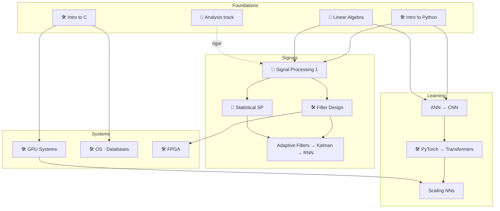

# Start Here

New to the curriculum? Pick the path that matches your goal. Every stop is a 30–40 min
session (see each topic's README for the session tables).

## Suggested paths

**"I want to do DSP"** —
[Python](./Intro_Programming/Intro_Python/Intro_Python.ipynb) →
[Signal Processing 1](./Intro_DSP/README.md) →
[Filter Design](./Intro_DSP/Filter_Design.ipynb) →
[Statistical SP](./Intro_DSP/README.md) →
[Adaptive Filtering](./Intro_Time_Series/README.md).
*Rigor on demand:* [Analysis](./Intro_Math/Analysis/README.md) &
[Linear Algebra](./Intro_Math/README.md).

**"I want to do ML"** —
[Python](./Intro_Programming/Intro_Python/Intro_Python.ipynb) →
[ANN](./Intro_Mach_Learn/Intro_ANN/Intro_ANN.ipynb) →
[PyTorch](./Intro_DL_4_Physics/intro_pytorch/intro_pytorch.ipynb) →
[CNN](./Intro_Mach_Learn/Intro_CNN/Intro_CNN.ipynb) →
[Transformers](./Intro_DL_4_Physics/intro_transformers/intro_transformers.ipynb) →
[Scaling](./Intro_Mach_Learn/Scale_NN/Scale_NN.ipynb).

**"I want to make things fast"** —
[C](./Intro_Programming/Intro_C.ipynb) →
[Data Structures](./Intro_Programming/Data_Structures_in_C.ipynb) →
[OS](./Intro_Host_Prog/Intro_OS/Intro_OS.ipynb) →
[GPU](./Intro_GPU/README.md) →
[FPGA](./Intro_FPGA/README.md).

**"I want the mathematics"** — the [Analysis track](./Intro_Math/Analysis/README.md) in
order (Real Numbers → Topology → Sequences → Measure → Random Variables → Independence),
with [Linear Algebra](./Intro_Math/README.md) in parallel.

Full inventory: the [README table](./README.md#workshops). What's coming:
[ROADMAP.md](./ROADMAP.md).
